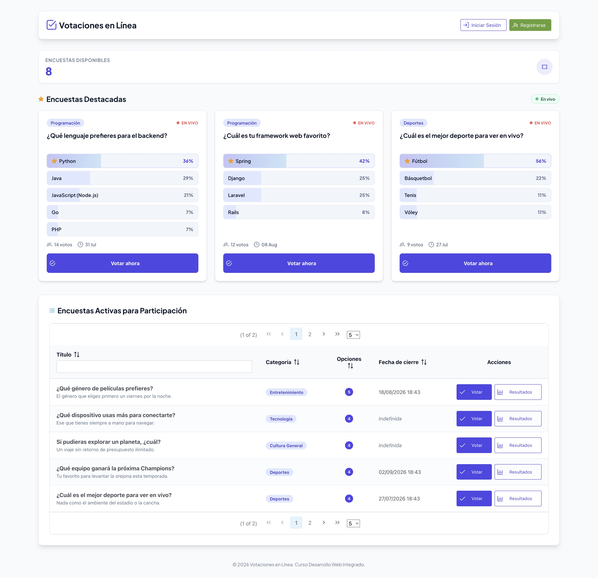
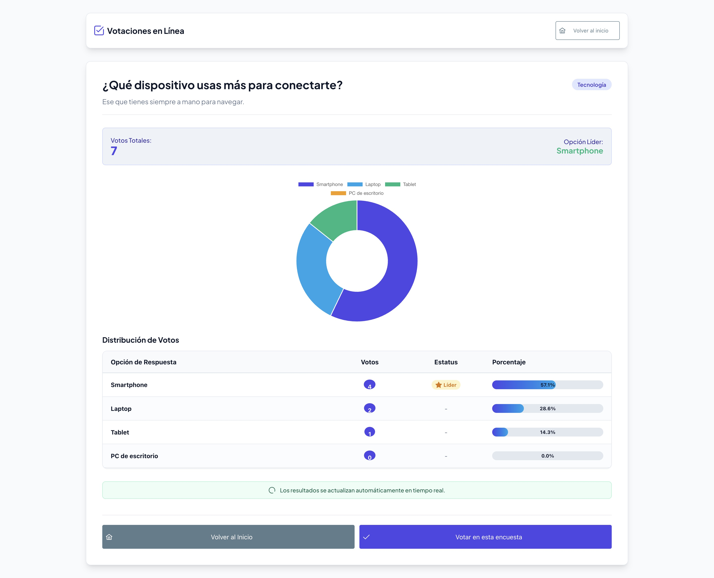
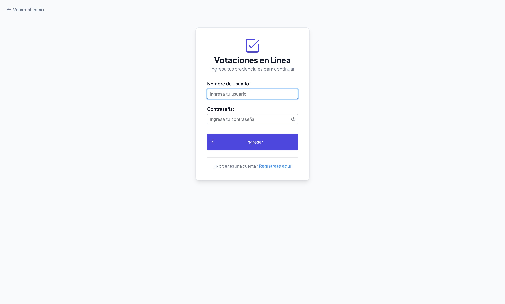
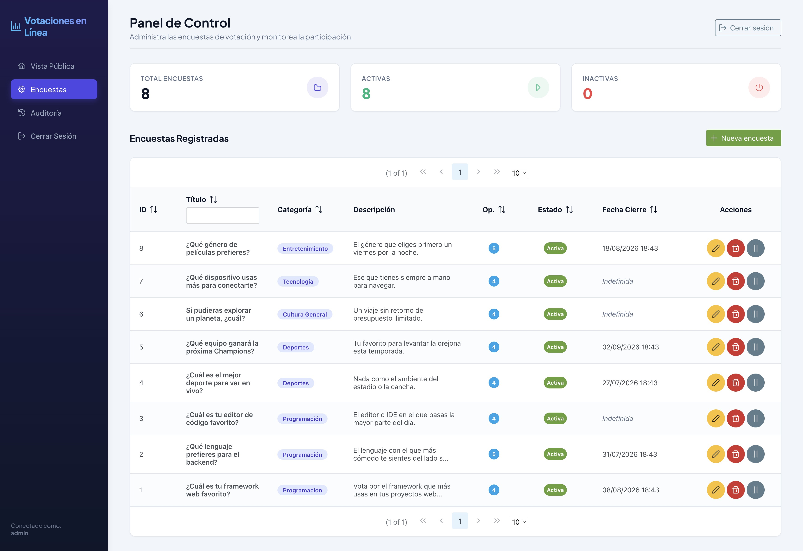
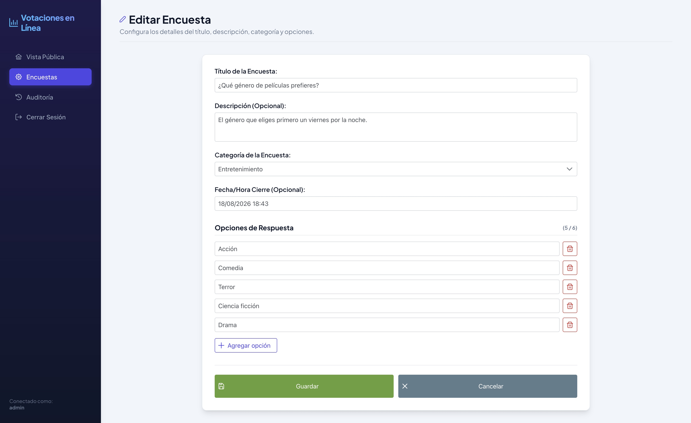

# Sistema de Votación en Línea

Aplicación web Jakarta EE que permite crear y administrar encuestas, emitir votos y consultar resultados en tiempo real. La pantalla principal destaca las encuestas más votadas con **resultados en vivo** (barras que se actualizan solas vía AJAX), los resultados se visualizan con **gráficos de dona**, y todas las acciones administrativas quedan registradas en una **bitácora de auditoría**. Construida con vistas JSF (Facelets) + PrimeFaces 13 sobre Managed Beans CDI y persistencia JDBC directa contra MySQL.

## Tecnologías

- Java 17 + Jakarta EE 10
- Jakarta Faces 4.0 (Mojarra)
- **PrimeFaces 13** (build `jakarta`) con el tema **saga** integrado
- **PrimeFaces Charts** (basados en Chart.js) para los gráficos de resultados
- **PrimeFlex 3** (utilidades CSS / grid)
- CDI 4.0 (Weld) sobre Apache Tomcat 10
- JDBC plano (sin ORM)
- MySQL 8
- Maven (empaquetado WAR)

## Arquitectura por capas

```
src/main/java/com/votacion/
├── model/   POJOs de dominio (Encuesta, Opcion, Usuario, Categoria, AuditoriaAdmin)
├── dao/     Acceso JDBC (EncuestaDAO, VotoDAO, UsuarioDAO, CategoriaDAO, AuditoriaDAO)
├── filter/  Filtros HTTP (SecurityFilter)
└── bean/    Managed Beans CDI (EncuestaBean, VotacionBean, LoginBean, RegistroBean, AuditoriaBean)

src/main/webapp/
├── index.xhtml, votar.xhtml, resultados.xhtml, login.xhtml, registro.xhtml
├── admin/encuestas.xhtml, admin/formulario.xhtml, admin/auditoria.xhtml
└── WEB-INF/  web.xml, faces-config.xml, beans.xml
```

| Capa     | Responsabilidad                                                                                            |
| -------- | ---------------------------------------------------------------------------------------------------------- |
| `model`  | Entidades simples, sin lógica de negocio                                                                   |
| `dao`    | Consultas SQL, transacciones, mapeo `ResultSet` → POJO                                                     |
| `filter` | Interceptación de peticiones HTTP para seguridad (autenticación y autorización)                            |
| `bean`   | Estado de vista y sesión, orquestación, validaciones, navegación JSF                                       |
| `vistas` | Facelets con `h:`, `f:`, `ui:` y componentes `p:` (PrimeFaces); `f:viewParam` + `f:viewAction` para estado |

## Base de datos

Estructura de la base de datos `votacion_db` completamente normalizada en 3FN:

- **`usuario`** — `id` PK, `username` (UNIQUE), `password_hash` (BCrypt), `email` (UNIQUE), `rol` (ADMIN/VOTANTE), `fecha_creacion`
- **`categoria`** — `id` PK, `nombre` (UNIQUE), `descripcion`
- **`encuesta`** — `id` PK, `categoria_id` FK ➡️ `categoria.id`, `titulo`, `descripcion`, `activa`, `fecha_creacion`
- **`opciones`** — `id` PK, `encuesta_id` FK ➡️ `encuesta.id` (ON DELETE CASCADE), `texto`, `orden`
- **`registro_participacion`** — `usuario_id` FK ➡️ `usuario.id`, `encuesta_id` FK ➡️ `encuesta.id` (PK compuesta)
- **`votos`** — `id` PK, `usuario_id`, `encuesta_id` (FK compuesta ➡️ `registro_participacion`), `opcion_id` FK ➡️ `opciones.id`
- **`auditoria_admin`** — `id` PK, `usuario_id` FK ➡️ `usuario.id`, `accion`, `detalles`, `fecha`. La escribe `AuditoriaDAO` cada vez que un administrador crea, edita, elimina, activa o desactiva una encuesta.

Borrar una encuesta elimina en cascada sus opciones y votos. Script completo en `db/schema.sql` con datos semilla abundantes (IDs explícitos, deterministas): **15 usuarios, 5 categorías, 8 encuestas, 64 votos** y una bitácora de auditoría de ejemplo.

## Resultados en tiempo real (AJAX polling, **sin WebSockets**)

Los resultados se actualizan solos, sin recargar la página y **sin WebSockets**. El mecanismo es **sondeo AJAX** con el componente `<p:poll>` de PrimeFaces: cada cierto intervalo dispara una petición AJAX que vuelve a renderizar únicamente una parte de la vista con los datos frescos de la base de datos.

**Dónde se usa:**

- **Inicio** (`index.xhtml`) — refresca las encuestas destacadas cada 6 s:
  ```xhtml
  <p:poll interval="6" listener="#{votacionBean.actualizarDestacadas}" update="destacadasPanel" />
  ```
  El `listener` recalcula el top‑3 por votos con **una sola consulta** (`VotoDAO.obtenerResultadosPorEncuestas`, que evita el problema N+1) y `update` repinta solo el panel de destacadas.

- **Resultados** (`resultados.xhtml`) — refresca el conteo, las barras y el gráfico de dona cada 4 s:
  ```xhtml
  <p:poll interval="4" update="resultadosForm" />
  ```

**Cómo fluye una actualización:**

```
navegador ── cada N s ──▶ petición AJAX (p:poll)
    ▲                          │
    │                   ciclo JSF → el bean lee los conteos frescos del DAO
    │                          │
    └── DOM parcheado en sitio ◀── render parcial de la región (update="...")
```

No hay recarga completa: PrimeFaces reemplaza solo el fragmento indicado en `update`. El gráfico de dona tiene la **animación de entrada desactivada** (`Animation.setDuration(0)`) para que el repintado periódico no vuelva a ejecutar el barrido y parezca un parpadeo.

**¿Por qué polling y no WebSockets?**

| Criterio    | AJAX polling (`p:poll`) — elegido            | WebSockets (`p:socket` / PrimeFaces Push)        |
| ----------- | -------------------------------------------- | ------------------------------------------------ |
| Integración | Ya incluido, 0 dependencias extra            | Requiere runtime Atmosphere + configuración push |
| Complejidad | Trivial                                      | Más frágil sobre Tomcat + Weld                   |
| Latencia    | 4–6 s (imperceptible para motivar el voto)   | Instantánea                                      |
| Escala      | Ideal hasta decenas de usuarios simultáneos  | Rinde con cientos/miles a la vez                 |

Para un proyecto de curso, el sondeo cada pocos segundos es suficiente y mucho más simple; los WebSockets solo valdrían la pena con mucha concurrencia o necesidad de latencia sub‑segundo.

## Ejecución

### Requisitos
- JDK 17
- Maven 3.9+
- MySQL 8 corriendo en `localhost:3306` (o `DB_FALLBACK_H2=true` para usar H2 en memoria en desarrollo)
- Apache Tomcat 10 (o el plugin Cargo, ver más abajo)
- IntelliJ IDEA (recomendado)

### Pasos
1. Clonar el repo y abrir como proyecto Maven en IntelliJ.
2. Ejecutar `db/schema.sql` en MySQL para crear `votacion_db` y datos iniciales.
3. Configurar las variables de entorno de conexión (ver sección siguiente) — **requeridas**: la aplicación ya no asume credenciales por defecto.
4. Configurar un *Run Configuration* de Tomcat 10 en IntelliJ apuntando al artefacto `votacion:war exploded` (context path `/votacion`).
5. Iniciar Tomcat y abrir [http://localhost:8080/votacion/](http://localhost:8080/votacion/).

### Compilar y ejecutar por línea de comandos

```bash
mvn clean package        # Genera el WAR -> target/votacion.war
mvn package cargo:run    # Descarga Tomcat 10 y levanta la app en :8080
```

`mvn package cargo:run` provisiona un Apache Tomcat 10 automáticamente (plugin Cargo) y despliega la app en [http://localhost:8080/votacion/](http://localhost:8080/votacion/), sin necesidad de un Tomcat instalado.

> ⚠️ El wrapper `mvnw` tiene finales de línea CRLF, por lo que `./mvnw` falla en macOS/Linux (`bad interpreter: /bin/sh^M`). Usa un `mvn` instalado globalmente, o convierte el wrapper con `sed -i '' 's/\r$//' mvnw`.

### Configuración de la base de datos

`DBConnection` lee las credenciales **exclusivamente de variables de entorno**; no hay valores por defecto inseguros (ya no asume `root` sin contraseña). Si falta una variable requerida, la aplicación falla al iniciar con un mensaje explícito en vez de conectarse con credenciales adivinadas.

| Variable         | Requerida                        | Descripción                                                       |
| ---------------- | -------------------------------- | ---------------------------------------------------------------- |
| `DB_URL`         | sí (no vacía)                    | URL JDBC, p. ej. `jdbc:mysql://localhost:3306/votacion_db`        |
| `DB_USER`        | sí (no vacía)                    | Usuario MySQL                                                     |
| `DB_PASSWORD`    | sí (puede ser vacía, debe estar) | Contraseña MySQL — se admite vacía, pero debe definirse explícito |
| `DB_FALLBACK_H2` | no (por defecto desactivado)     | `true` para usar H2 en memoria si MySQL no responde              |

El fallback a **H2 en memoria es opt-in**: sin `DB_FALLBACK_H2=true`, un fallo de conexión a MySQL se propaga en lugar de ocultarse. Útil para desarrollo sin una instancia MySQL corriendo.

**Cómo configurarlas en IntelliJ antes de desplegar:**

1. Abrir *Run / Edit Configurations…* y seleccionar la configuración de Tomcat.
2. En la pestaña *Startup/Connection* o en el bloque *Environment variables* del *Run Configuration*, definir cada variable (`DB_URL=…`, `DB_USER=…`, `DB_PASSWORD=…`).
3. Aplicar y reiniciar Tomcat para que las variables se inyecten al proceso.

Alternativamente, exportarlas en la shell antes de lanzar el servidor:

```bash
export DB_URL='jdbc:mysql://localhost:3306/votacion_db'
export DB_USER='votacion_user'
export DB_PASSWORD='secret'
# export DB_FALLBACK_H2=true   # opcional: usar H2 en memoria si no hay MySQL local
```

## Funcionalidades del avance 3

- **Autenticación y Roles:** Cuentas de usuario diferenciadas para Administradores (`ADMIN`) y Votantes (`VOTANTE`) con cifrado de contraseñas mediante `jbcrypt` (BCrypt).
- **Filtro de Seguridad:** Interceptación y protección de todas las rutas administrativas `/admin/*` mediante `SecurityFilter`.
- **Organización por Categorías:** Clasificación y filtrado de encuestas según categorías precargadas.
- **Restricción de Voto Único:** Control a nivel de base de datos (`registro_participacion`) y de interfaz para evitar que un usuario vote más de una vez en la misma encuesta.
- **HUD Dinámico:** Estado de autenticación integrado en el Dashboard público (saludo de bienvenida al usuario e inicio/cierre de sesión dinámico).
- **CRUD de encuestas** con opciones dinámicas (2–6 por encuesta), título, descripción y asignación de categoría.
- **Dashboard público** que lista únicamente encuestas con `activa = true`.
- **Flujo de votación** con resultados inline (porcentaje y conteo) tras emitir el voto.
- **Panel de administración** con crear, editar, eliminar y activar/desactivar.
- **UI con PrimeFaces 13** (tema saga).

### Usuarios de Prueba (Semilla)
La semilla crea **15 usuarios** (1 administrador + 14 votantes):
* **Administrador:** `admin` / `admin123`
* **Votantes principales:** `juan` / `juan123`, `maria` / `maria123`
* **`ana`, `luis`, `marta`:** contraseña `juan123`
* **`pedro`, `sofia`, `diego`, `valentina`, `carlos`, `lucia`, `andres`, `camila`, `mateo`:** contraseña `demo123`

## Funcionalidades del avance 4

- **Encuestas destacadas en tiempo real:** La pantalla principal muestra las 3 encuestas más votadas con barras de resultados que se refrescan solas (`p:poll`, sondeo AJAX cada 6 s) conforme llegan votos — sin WebSockets.
- **Gráficos de resultados:** Distribución de votos en un **gráfico de dona** (PrimeFaces Charts / Chart.js) en `resultados.xhtml` y en `votar.xhtml` tras votar, sincronizado con el conteo en vivo.
- **Bitácora de auditoría:** Toda acción administrativa (crear, editar, eliminar, activar, desactivar) se registra en `auditoria_admin` con usuario, acción y detalle. Nueva vista `admin/auditoria.xhtml` con la bitácora paginada y filtrable.
- **Consistencia de UI:** Color primario unificado (índigo de marca), botones normalizados al namespace `ui-button-*` del tema saga y barras de porcentaje corregidas para que la etiqueta siempre sea legible.
- **Datos de prueba ampliados:** 15 usuarios, 5 categorías, 8 encuestas y 64 votos repartidos para que resultados y gráficos luzcan con contenido real.

## Navegación

| Vista                     | Propósito                                                            |
| ------------------------- | -------------------------------------------------------------------- |
| `index.xhtml`             | Dashboard público: encuestas destacadas con resultados en vivo + tabla de activas |
| `login.xhtml`             | Formulario de inicio de sesión con PrimeFaces                        |
| `registro.xhtml`          | Registro de nuevos usuarios votantes                                 |
| `votar.xhtml`             | Formulario de votación + resultados inline (gráfico + tabla) tras votar |
| `resultados.xhtml`        | Resultados de la encuesta: gráfico de dona + tabla, con refresco en vivo |
| `admin/encuestas.xhtml`   | Listado administrativo con acciones (editar, eliminar, toggle)       |
| `admin/formulario.xhtml`  | Crear o editar encuesta con opciones dinámicas y categorías          |
| `admin/auditoria.xhtml`   | Bitácora de acciones administrativas (fecha, usuario, acción, detalle) |

Navegación entre vistas: `p:button outcome="..."` (GET / link) con `f:param` para pasar `encuestaId`; la vista destino lo recibe con `f:viewParam` y dispara `f:viewAction` para cargar estado desde el DAO. Las acciones que mutan datos (votar, guardar, eliminar) usan `p:commandButton` con `action="#{bean.metodo()}"` (POST) y, donde corresponde, `update="@form"` para refrescar parcialmente sin recarga completa.

## Checklist de avances

- [x] **Avance 1** — Estructura base del proyecto, servlets de ejemplo, JSPs iniciales y conexión JDBC.
- [x] **Avance 2** — Arquitectura por capas, esquema normalizado, CRUD de encuestas, migración a JSF + CDI con Managed Beans `@ViewScoped`.
- [x] **Avance 3** — Normalización de base de datos (Tercera Forma Normal), inicio de sesión y registro de usuarios, organización por categorías y restricción de voto único.
- [x] **Avance 4** — Encuestas destacadas con resultados en tiempo real (AJAX polling), gráficos de dona, bitácora de auditoría de acciones administrativas y homogeneización de la UI.

## Evidencias

Capturas de la plataforma actual (PrimeFaces 13 + tema saga), en `doc/`:

### Dashboard público — `index.xhtml`
Encuestas **destacadas** (las más votadas) con barras de resultados en vivo y badge "En vivo"; debajo, la tabla paginada y filtrable de todas las encuestas activas.



### Resultados — `resultados.xhtml`
Gráfico de **dona** con la distribución de votos, tarjeta de resumen (total y opción líder) y tabla detallada con conteo, líder y porcentaje; se refresca solo en tiempo real.



### Inicio de sesión — `login.xhtml`
Formulario de login con PrimeFaces (mostrar/ocultar contraseña) y enlace al registro.



### Panel de administración — `admin/encuestas.xhtml`
Dashboard con barra lateral (Vista Pública, Encuestas, **Auditoría**), tarjetas de estadísticas y tabla de encuestas con acciones (editar / eliminar / activar-desactivar).



### Editar / crear encuesta — `admin/formulario.xhtml`
Formulario con título, descripción, categoría, fecha de cierre y opciones dinámicas (2–6). Editar una encuesta **conserva los votos** ya emitidos.


