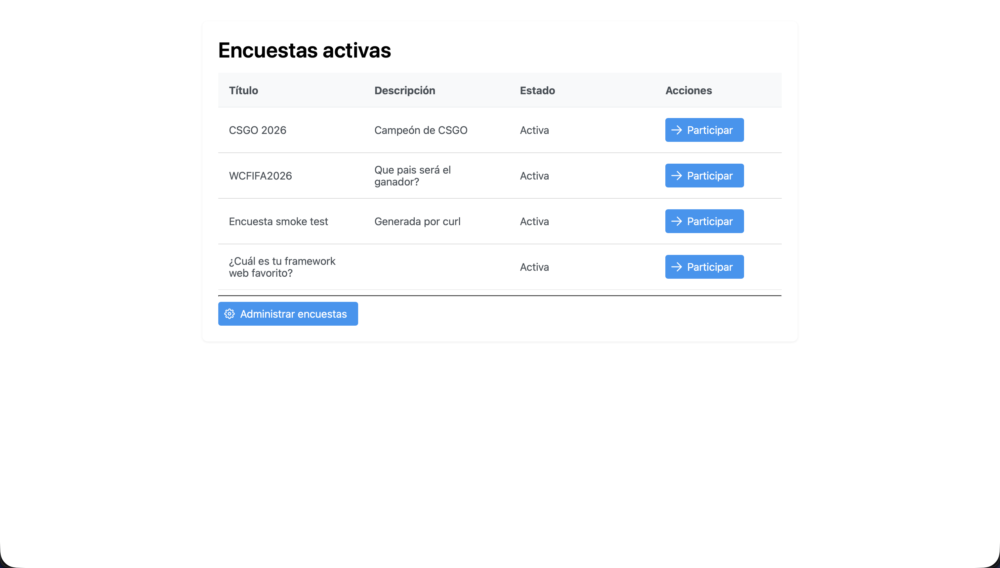
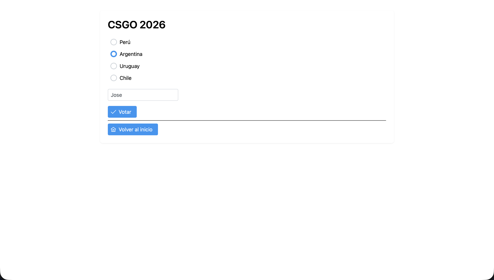
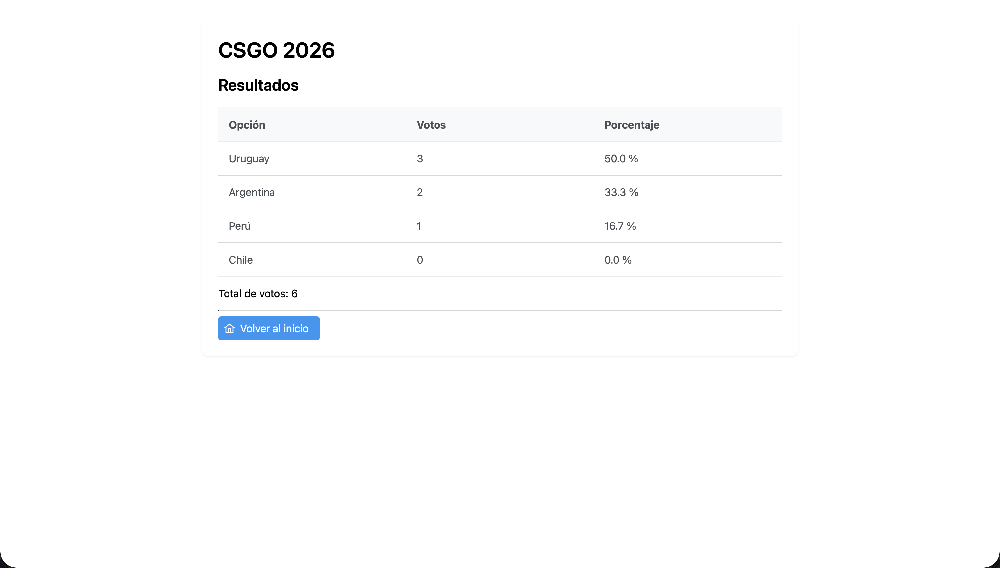
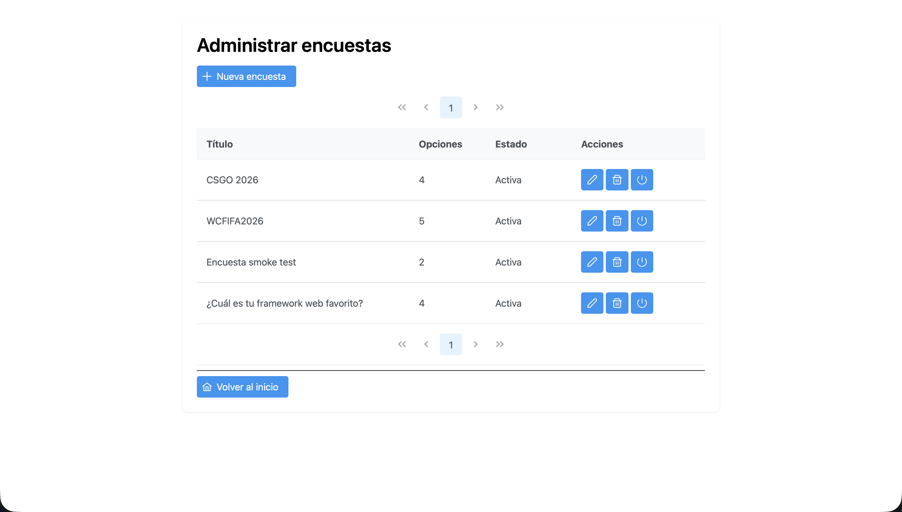
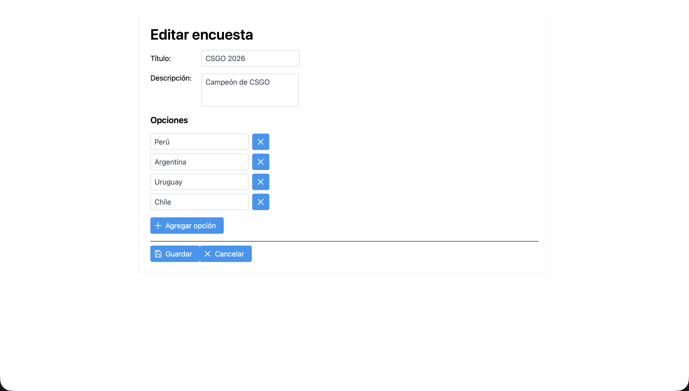

# Sistema de Votación en Línea

Aplicación web Jakarta EE que permite crear y administrar encuestas, emitir votos y consultar resultados en tiempo real. Construida con vistas JSF (Facelets) + PrimeFaces 13 sobre Managed Beans CDI y persistencia JDBC directa contra MySQL.

## Tecnologías

- Java 17 + Jakarta EE 10
- Jakarta Faces 4.0 (Mojarra)
- **PrimeFaces 13** (build `jakarta`) con el tema **saga** integrado
- **PrimeFlex 3** (utilidades CSS / grid)
- CDI 4.0 (Weld) sobre Apache Tomcat 10
- JDBC plano (sin ORM)
- MySQL 8
- Maven (empaquetado WAR)

## Arquitectura por capas

```
src/main/java/com/votacion/
├── model/   POJOs de dominio (Encuesta, Opcion, Usuario, Categoria)
├── dao/     Acceso JDBC (EncuestaDAO, VotoDAO, UsuarioDAO, CategoriaDAO)
├── filter/  Filtros HTTP (SecurityFilter)
└── bean/    Managed Beans CDI (EncuestaBean, VotacionBean, LoginBean, RegistroBean)

src/main/webapp/
├── index.xhtml, votar.xhtml, resultados.xhtml, login.xhtml, registro.xhtml
├── admin/encuestas.xhtml, admin/formulario.xhtml
└── WEB-INF/  web.xml, faces-config.xml, beans.xml
```

| Capa     | Responsabilidad                                                                                            |
| -------- | ---------------------------------------------------------------------------------------------------------- |
| `model`  | Entidades simples, sin lógica de negocio                                                                   |
| `dao`    | Consultas SQL, transacciones, mapeo `ResultSet` → POJO                                                     |
| `filter` | Interceptación de peticiones HTTP para seguridad (autenticación y autorización)                            |
| `bean`   | Estado de vista y sesión, orquestación, validaciones, navegación JSF                                       |
| `vistas` | Facelets con `h:`, `f:`, `ui:` y componentes `p:` (PrimeFaces); `f:viewParam` + `f:viewAction` para estado |

## Base de datos

Estructura de la base de datos `votacion_db` completamente normalizada en 3FN:

- **`usuario`** — `id` PK, `username` (UNIQUE), `password_hash` (BCrypt), `email` (UNIQUE), `rol` (ADMIN/VOTANTE), `fecha_creacion`
- **`categoria`** — `id` PK, `nombre` (UNIQUE), `descripcion`
- **`encuesta`** — `id` PK, `categoria_id` FK ➡️ `categoria.id`, `titulo`, `descripcion`, `activa`, `fecha_creacion`
- **`opciones`** — `id` PK, `encuesta_id` FK ➡️ `encuesta.id` (ON DELETE CASCADE), `texto`, `orden`
- **`registro_participacion`** — `usuario_id` FK ➡️ `usuario.id`, `encuesta_id` FK ➡️ `encuesta.id` (PK compuesta)
- **`votos`** — `id` PK, `usuario_id`, `encuesta_id` (FK compuesta ➡️ `registro_participacion`), `opcion_id` FK ➡️ `opciones.id`
- **`auditoria_admin`** — `id` PK, `usuario_id` FK ➡️ `usuario.id`, `accion`, `detalles`, `fecha`

Borrar una encuesta elimina en cascada sus opciones y votos. Script completo en `db/schema.sql` con datos semilla.

## Ejecución

### Requisitos
- JDK 17
- Maven 3.9+
- MySQL 8 corriendo en `localhost:3306`
- Apache Tomcat 10
- IntelliJ IDEA (recomendado)

### Pasos
1. Clonar el repo y abrir como proyecto Maven en IntelliJ.
2. Ejecutar `db/schema.sql` en MySQL para crear `votacion_db` y datos iniciales.
3. Configurar las variables de entorno de conexión (ver sección siguiente) — opcional si los valores por defecto sirven.
4. Configurar un *Run Configuration* de Tomcat 10 en IntelliJ apuntando al artefacto `votacion:war exploded` (context path `/votacion`).
5. Iniciar Tomcat y abrir [http://localhost:8080/votacion/](http://localhost:8080/votacion/).

### Configuración de la base de datos

`DBConnection` lee tres variables de entorno con fallback a valores de desarrollo local:

| Variable      | Default                                       | Descripción                          |
| ------------- | --------------------------------------------- | ------------------------------------ |
| `DB_URL`      | `jdbc:mysql://localhost:3306/votacion_db`     | URL JDBC de la base                  |
| `DB_USER`     | `root`                                        | Usuario MySQL                        |
| `DB_PASSWORD` | *(vacío)*                                     | Contraseña MySQL                     |

**Cómo configurarlas en IntelliJ antes de desplegar:**

1. Abrir *Run / Edit Configurations…* y seleccionar la configuración de Tomcat.
2. En la pestaña *Startup/Connection* o en el bloque *Environment variables* del *Run Configuration*, definir cada variable (`DB_URL=…`, `DB_USER=…`, `DB_PASSWORD=…`).
3. Aplicar y reiniciar Tomcat para que las variables se inyecten al proceso.

Alternativamente, exportarlas en la shell antes de lanzar el servidor:

```bash
export DB_URL='jdbc:mysql://localhost:3306/votacion_db'
export DB_USER='votacion_user'
export DB_PASSWORD='secret'
```

## Funcionalidades del avance 3

- **Autenticación y Roles:** Cuentas de usuario diferenciadas para Administradores (`ADMIN`) y Votantes (`VOTANTE`) con cifrado de contraseñas mediante `jbcrypt` (BCrypt).
- **Filtro de Seguridad:** Interceptación y protección de todas las rutas administrativas `/admin/*` mediante `SecurityFilter`.
- **Organización por Categorías:** Clasificación y filtrado de encuestas según categorías precargadas.
- **Restricción de Voto Único:** Control a nivel de base de datos (`registro_participacion`) y de interfaz para evitar que un usuario vote más de una vez en la misma encuesta.
- **HUD Dinámico:** Estado de autenticación integrado en el Dashboard público (saludo de bienvenida al usuario e inicio/cierre de sesión dinámico).
- **CRUD de encuestas** con opciones dinámicas (2–6 por encuesta), título, descripción y asignación de categoría.
- **Dashboard público** que lista únicamente encuestas con `activa = true`.
- **Flujo de votación** con resultados inline (porcentaje y conteo) tras emitir el voto.
- **Panel de administración** con crear, editar, eliminar y activar/desactivar.
- **UI con PrimeFaces 13** (tema saga).

### Usuarios de Prueba (Semilla)
* **Administrador:** `admin` / `admin123`
* **Votante:** `juan` / `juan123`
* **Votante:** `maria` / `maria123`

## Navegación

| Vista                     | Propósito                                                            |
| ------------------------- | -------------------------------------------------------------------- |
| `index.xhtml`             | Dashboard público de encuestas activas con bienvenida y login        |
| `login.xhtml`             | Formulario de inicio de sesión con PrimeFaces                        |
| `registro.xhtml`          | Registro de nuevos usuarios votantes                                 |
| `votar.xhtml`             | Formulario de votación + resultados inline tras emitir el voto       |
| `resultados.xhtml`        | Vista independiente de resultados de la encuesta actual              |
| `admin/encuestas.xhtml`   | Listado administrativo con acciones (editar, eliminar, toggle)       |
| `admin/formulario.xhtml`  | Crear o editar encuesta con opciones dinámicas y categorías          |

Navegación entre vistas: `p:button outcome="..."` (GET / link) con `f:param` para pasar `encuestaId`; la vista destino lo recibe con `f:viewParam` y dispara `f:viewAction` para cargar estado desde el DAO. Las acciones que mutan datos (votar, guardar, eliminar) usan `p:commandButton` con `action="#{bean.metodo()}"` (POST) y, donde corresponde, `update="@form"` para refrescar parcialmente sin recarga completa.

## Checklist de avances

- [x] **Avance 1** — Estructura base del proyecto, servlets de ejemplo, JSPs iniciales y conexión JDBC.
- [x] **Avance 2** — Arquitectura por capas, esquema normalizado, CRUD de encuestas, migración a JSF + CDI con Managed Beans `@ViewScoped`.
- [x] **Avance 3** — Normalización de base de datos (Tercera Forma Normal), inicio de sesión y registro de usuarios, organización por categorías y restricción de voto único.
- [ ] **Avance 4** — Pendiente.

## Evidencias

Capturas de la aplicación con PrimeFaces 13 + tema saga (`doc/`):

### Dashboard público — `index.xhtml`
Lista las encuestas con `activa = true` en un `p:dataTable`.



### Votar — `votar.xhtml`
Selección de opción con `p:selectOneRadio`, nombre opcional del votante y botón de envío con `update="@form"` para mostrar los resultados inline.



### Resultados — `votar.xhtml` (tras votar) / `resultados.xhtml`
Conteo y porcentaje por opción en un `p:dataTable`.



### Panel de administración — `admin/encuestas.xhtml`
Listado con paginación, acciones (editar / eliminar / activar-desactivar) y `p:confirmDialog` global para el borrado.



### Editar / crear encuesta — `admin/formulario.xhtml`
Edición de opciones dinámicas (2–6) con AJAX vía `update="@form"` para preservar lo tipeado al agregar o eliminar filas.


